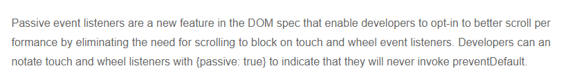

# 移动端日常开发遇坑填坑大法

@(fishmankkk)

##**移动端屏幕滚动事件（禁止滚动、激活滚动）：
页面出现遮罩层，主页面长度超过页面长度，在遮罩层不允许滚动，关闭遮罩层之后允许正常滚动

###**JS方法**：
一开始尝试了e.preventDefault()的方法
``` javascript
$("body").bind("touchmove",function(e){
    e.preventDefault(); //阻止默认的处理方式(阻止下拉滑动的效果)
});
```
页面提示

原来Chorme56+开始为了让页面滚动变得更为流畅，在 window、document 和 body 上注册的 touchstart 和 touchmove 事件处理函数，会默认为是 passive: true。浏览器忽略默认事件的preventDefault(), 你要是手动阻止会弹出一个警告, 告诉你阻止不了!!!
使用下面的方法就可以解决这个问题了
``` javascript
$("body").bind("touchmove",function(e){
    e.preventDefault(); //阻止默认的处理方式(阻止下拉滑动的效果)
}, {passive: false});
```
那这个passive到底是个什么东西呢，用官方的说法：

Passive Event Listeners是Chrome提出的一个新的浏览器特性：Web开发者通过一个新的属性passive来告诉浏览器，当前页面内注册的事件监听器内部是否会调用preventDefault函数来阻止事件的默认行为，以便浏览器根据这个信息更好地做出决策来优化页面性能。当属性passive的值为true的时候，代表该监听器内部不会调用preventDefault函数来阻止默认滑动行为，Chrome浏览器称这类型的监听器为被动(passive)监听器。目前Chrome主要利用该特性来优化页面的滑动性能，所以Passive Event Listeners特性当前仅支持mousewheel/touch相关事件。
- **禁止滚动** ：
``` javascript
$("body").bind("touchmove",function(e){
    e.preventDefault(); //阻止默认的处理方式(阻止下拉滑动的效果)
}, {passive: false});
```
- **激活滚动** ：
``` javascript
$("body").unbind("touchmove");
```

-------------------


